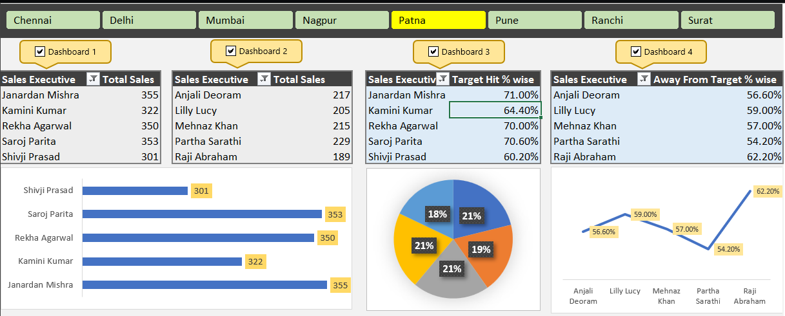

# 📊 Excel Sales Performance Dashboard

An interactive **Sales Performance Dashboard** built in **Microsoft Excel** using **Pivot Tables, Pivot Charts, Conditional Formatting, and Excel Formulas** to visualize employee sales performance, monitor target achievement, and generate business insights.

---

## 🚀 Project Overview

This dashboard provides an easy way to analyze sales data and evaluate employee performance through interactive charts and KPI metrics. It helps identify top performers, employees needing improvement, and overall sales trends.

---

## ✨ Features

- 📈 Interactive Sales Dashboard
- 🏆 Top 5 Sales Executives
- 📉 Bottom 5 Sales Executives
- 🎯 Target Achievement Percentage
- 📊 Away From Target Percentage
- 📋 KPI-Based Reporting
- 📌 Pivot Tables & Pivot Charts
- 🎨 Conditional Formatting

---

## 🛠️ Tools Used

- Microsoft Excel
- Pivot Tables
- Pivot Charts
- Excel Formulas
- Conditional Formatting

---

## 📊 Dashboard Preview



---

## 📂 Repository Structure

```text
Excel-Sales-Performance-Dashboard/
│
├── README.md
├── Sales_Performance_Dashboard.xlsm
└── dashboard.png
```

---

## 📁 Dataset

The dataset includes:

- Employee Code
- Sales Executive Name
- Region
- Day-wise Sales (Day 1–Day 5)
- Total Sales
- Sales Target
- Target Hit %
- Away From Target %

---

## 📈 Key Insights

- Compare actual sales against targets
- Identify top-performing employees
- Track employees below target
- Monitor overall sales performance
- Analyze business KPIs

---

## ▶️ How to Use

1. Download or clone this repository.
2. Open **Sales_Performance_Dashboard.xlsm** in Microsoft Excel.
3. Enable Editing and Macros (if prompted).
4. Explore the interactive dashboard.

---

## 👨‍💻 Author

**Takshil Patel**

GitHub: https://github.com/TakshilKathiriya

---

⭐ If you found this project helpful, consider giving it a **Star**.
